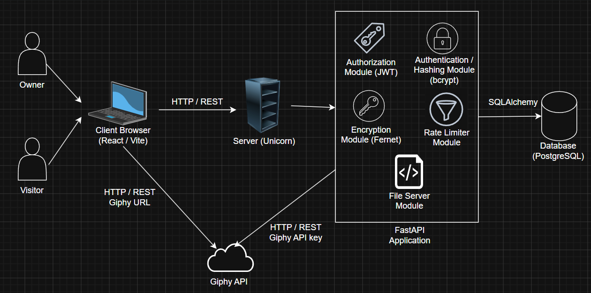
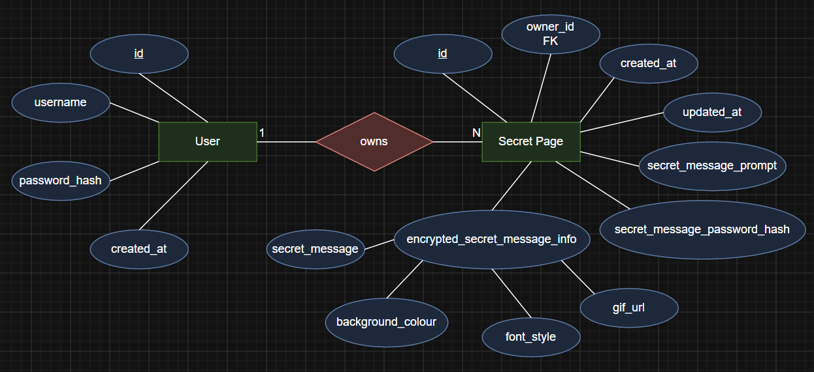

# Secrets

Compose a secret with a message, GIF and your own colors and typography. Share it with a link behind a personalized prompt and password.

**Try the app:** https://secretsbysrijan.vercel.app

> After September, the backend will run on Render's free tier and sleeps after inactivity. The first request may take up to a minute.

## Demo

https://github.com/user-attachments/assets/90921c0a-bcc3-40bd-8513-7c1db7a85df8

## How it works

The message, GIF, font and color are encrypted together with Fernet before they are stored. The visitor password is hashed with bcrypt and never stored in plain text. Unlocking verifies the hash first, then decrypts server-side, so that the ciphertext never reaches the browser. Secrets are addressed by a random UUID, so the URLs cannot be guessed or enumerated.

## System Design Architecture



## Database Design



## Stack

- **Backend**: FastAPI, SQLAlchemy, Alembic, PyJWT, bcrypt, cryptography
- **Frontend**: React, Vite, TanStack Query, React Router, Tailwind
- **Database**: PostgreSQL
- **Hosting**: Render (Backend), Vercel (Frontend), Supabase (Database)

## Run locally

Requires Python 3.13, Node 20+, and a PostgreSQL database.

**Backend**

```powershell
cd backend
python -m venv .venv; .\.venv\Scripts\activate
pip install -r requirements.txt
copy .env.example .env    #  then fill in the values
alembic upgrade head
uvicorn main:app --reload
```

**Frontend**

```powershell
cd frontend
npm install
copy .env.example .env
npm run dev
```

**Tests**

```powershell
cd backend
pytest
```

**Environment**

Both `.env.example` files carry placeholders and the commands to generate the keys.
